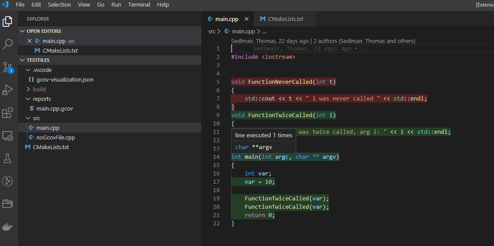

[](https://dev.azure.com/thomassedlmair/vscode-gcov-visualization/_build/latest?definitionId=1&branchName=master)


# vscode-gcov-visualization

VSCode extension to visualize gcov reports. After running the executable and creating the *.gcov files you can either `Toggle Gcov` or `ctrl + F1`. Afterwards the created *.gcov files are parsed and matched to the opened source file. Prior running the command, the coverage report has to be created by gcov.exe. The executed lines are decorated with green color, non executed lines by red color. A hovermessage shows the number of executions for each line.  Extension still under development.



## Example

There is a sample directory inside this project. This contains a sample coverage report with the corersponding source file. This directory is also used by the unittests. 

## Debugging

Install all packages, start debugging and open the sample folder within the running vscode application. 
```
npm install
```


## what's next?

* attaching overall coverage percentage to statusbar
* create a dark and light green decorator
* create coverage report automatically / by command 
* ux improvement like hints if no gcov files found, wrong fileformat ... 
